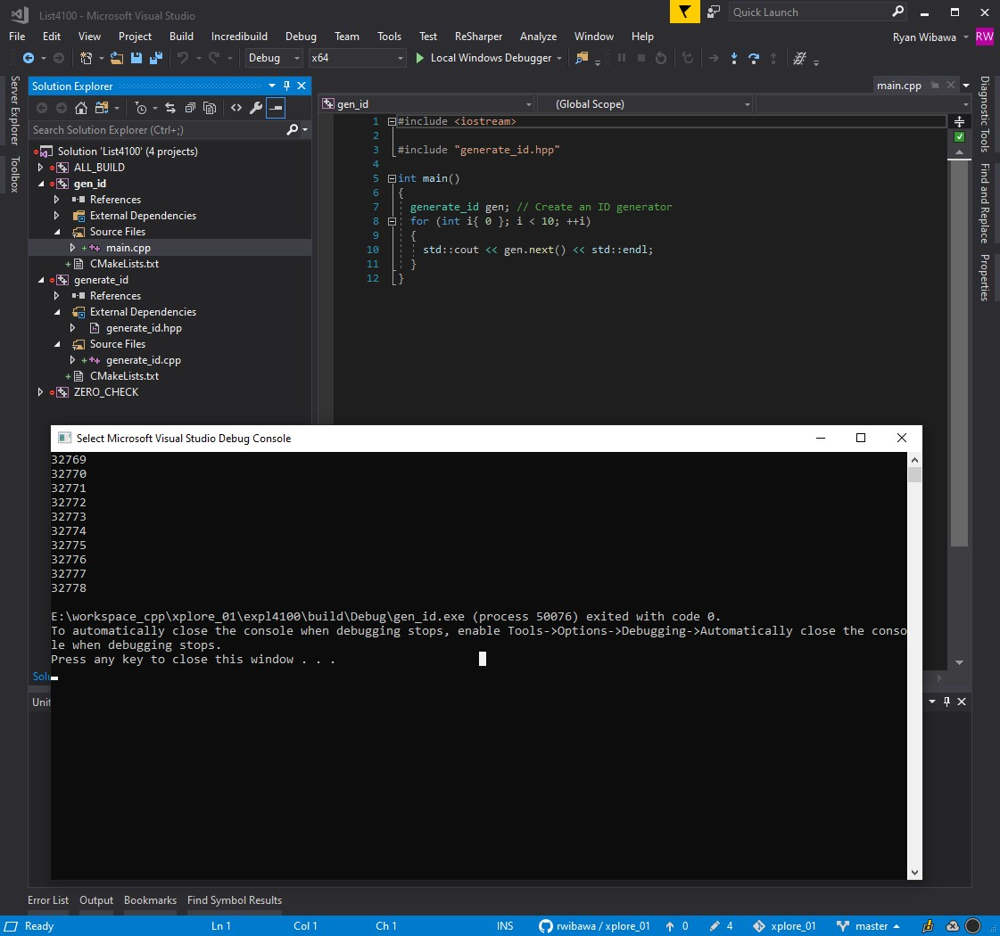
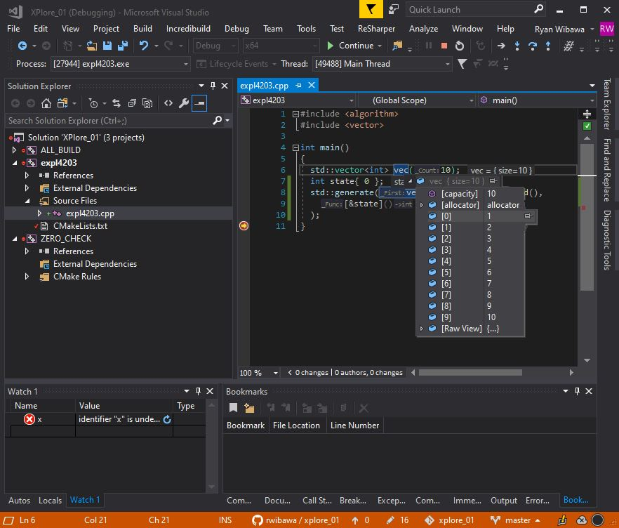

# xplore_01
Exploring C++ 11
* [Exploring C++ 11, Second Edition](http://www.apress.com/9781430261933)
* [cmake 3.14.6](https://cmake.org/download/)
* [Source codes](https://github.com/Apress/exploring-c-11)

# 1. Setup
```sh
$ mkdir build
$ cd build
$ cmake --version
$ cmake -G "Unix Makefiles" -DCMAKE_BUILD_TYPE=Debug ..
$ make -j8

~/workspace_c++/xplore_01/build$ ll expl4101/
total 48
drwxr-xr-x 3 ryan ryan  4096 Oct  5 23:12 ./
drwxr-xr-x 6 ryan ryan  4096 Oct  5 23:12 ../
drwxr-xr-x 4 ryan ryan  4096 Oct  5 23:12 CMakeFiles/
-rw-r--r-- 1 ryan ryan  7116 Oct  5 23:12 Makefile
-rw-r--r-- 1 ryan ryan  1133 Oct  5 23:12 cmake_install.cmake
-rwxr-xr-x 1 ryan ryan 17608 Oct  5 23:12 gen_id*
-rw-r--r-- 1 ryan ryan  2082 Oct  5 23:12 libgenerate_id.a
```

## VSCode Build & Debug
* Press `ctl-shift-b` to build.
* Press `ctl-shift-p` (command palette) and select 'CMake: Select a kit' to select a compiler.
* Press `ctl-shift-p` (command palette) and select 'CMake: Build Target' to build.
* Press `F5` to start debugging.

## 2. Output:
### `expl0802`
```sh
Date: 03/14/2006
Pay to the order of: CASH
The amount of $******42.07

E:\workspace_cpp\xplore_01\build\Debug\expl0802.exe (process 42836) exited with code 0.
To automatically close the console when debugging stops, enable Tools->Options->Debugging->Automatically close the console when debugging stops.
Press any key to close this window . . .
```

### `expl0803`
```sh
000042
420000
42
-42-

E:\workspace_cpp\xplore_01\build\Debug\expl0803.exe (process 22460) exited with code 0.
To automatically close the console when debugging stops, enable Tools->Options->Debugging->Automatically close the console when debugging stops.
Press any key to close this window . . .
```

### `expl0804`
```sh
   *|   1   2   3   4   5   6   7   8   9  10
----+----------------------------------------
   1|   1   2   3   4   5   6   7   8   9  10
   2|   2   4   6   8  10  12  14  16  18  20
   3|   3   6   9  12  15  18  21  24  27  30
   4|   4   8  12  16  20  24  28  32  36  40
   5|   5  10  15  20  25  30  35  40  45  50
   6|   6  12  18  24  30  36  42  48  54  60
   7|   7  14  21  28  35  42  49  56  63  70
   8|   8  16  24  32  40  48  56  64  72  80
   9|   9  18  27  36  45  54  63  72  81  90
  10|  10  20  30  40  50  60  70  80  90 100

E:\workspace_cpp\xplore_01\build\Debug\expl0804.exe (process 28748) exited with code 0.
To automatically close the console when debugging stops, enable Tools->Options->Debugging->Automatically close the console when debugging stops.
Press any key to close this window . . .
```

### `expl0901`
```sh
46
73
4
377
3476
-23
89
-75
-375
2986
-4364
3463
^Z
-4364
-375
-75
-23
4
46
73
89
377
2986
3463
3476

E:\workspace_cpp\xplore_01\build\Debug\expl0901.exe (process 42452) exited with code 0.
To automatically close the console when debugging stops, enable Tools->Options->Debugging->Automatically close the console when debugging stops.
Press any key to close this window . . .
```


### `expl1401`
#### `list1402.in`
```
1 2 3 4 5 6 7 8 9 10
```
#### `list1402.out`
```
1
2
3
4
5
6
7
8
9
10
```

### `expl1501`
```sh
lorem
ipsum
dolor
sit
amet
lorem
ipsum
dolor
sit
lorem
ipsum
dolor
ipsum
^Z
amet    1
dolor   3
ipsum   4
lorem   3
sit     2

E:\workspace_cpp\xplore_01\build\Debug\expl1501.exe (process 36716) exited with code 0.
To automatically close the console when debugging stops, enable Tools->Options->Debugging->Automatically close the console when debugging stops.
Press any key to close this window . . .
```

### `expl1502`
```sh
Lorem ipsum dolor sit amet, consectetur adipiscing elit. Integer porttitor consectetur dui, congue suscipit magna. Ut et lacus accumsan, consectetur arcu ac, mollis urna. Etiam a auctor leo, a sodales tortor. Nulla facilisi. Etiam turpis felis, ullamcorper ut magna vitae, commodo tincidunt orci. Aliquam erat volutpat. Sed ut condimentum nisi. Proin laoreet nec lorem id volutpat. Nam eget pharetra ipsum.

Sed neque felis, posuere aliquet lacinia sed, commodo eu purus. Aliquam suscipit massa at bibendum ultrices. Morbi ullamcorper tempus arcu at luctus. Mauris sagittis tincidunt nisi ut iaculis. Aenean porttitor consectetur tortor, aliquam dignissim augue ultricies quis. Proin interdum sem at ex consectetur, sed porta ligula egestas. Phasellus augue arcu, vulputate nec scelerisque vel, euismod sit amet orci. Donec ornare justo at justo tempor imperdiet.

Ut mattis eu dolor vitae condimentum. Morbi sit amet maximus ex. Mauris nec sapien est. Pellentesque tincidunt mauris egestas, rhoncus sem dignissim, ornare metus. Nulla at augue libero. Proin fermentum ac lacus in pretium. Quisque tortor lacus, tincidunt vitae turpis a, fermentum auctor dolor. Mauris vel nulla justo. Integer ornare consectetur faucibus. Maecenas vel sapien tristique, dignissim mauris eget, fermentum nunc. Interdum et malesuada fames ac ante ipsum primis in faucibus. Pellentesque tristique a ligula in pharetra. Aenean augue nunc, convallis id nisi eget, ultricies mattis arcu. In maximus dolor ipsum, non maximus turpis laoreet non. Nulla sit amet ipsum dictum augue vulputate egestas suscipit vitae nisi.
^Z
Aenean               2
Aliquam              2
Donec                1
Etiam                2
In                   1
Integer              2
Interdum             1
Lorem                1
Maecenas             1
Mauris               3
Morbi                2
Nam                  1
Nulla                3
Pellentesque         2
Phasellus            1
Proin                3
Quisque              1
Sed                  2
Ut                   2
a                    3
a,                   1
ac                   2
ac,                  1
accumsan,            1
adipiscing           1
aliquam              1
aliquet              1
amet                 3
amet,                1
ante                 1
arcu                 2
arcu,                1
arcu.                1
at                   5
auctor               2
augue                5
bibendum             1
commodo              2
condimentum          1
condimentum.         1
congue               1
consectetur          5
consectetur,         1
convallis            1
dictum               1
dignissim            2
dignissim,           1
dolor                3
dolor.               1
dui,                 1
egestas              1
egestas,             1
egestas.             1
eget                 1
eget,                2
elit.                1
erat                 1
est.                 1
et                   2
eu                   2
euismod              1
ex                   1
ex.                  1
facilisi.            1
fames                1
faucibus.            2
felis,               2
fermentum            3
iaculis.             1
id                   2
imperdiet.           1
in                   3
interdum             1
ipsum                3
ipsum,               1
ipsum.               1
justo                2
justo.               1
lacinia              1
lacus                2
lacus,               1
laoreet              2
leo,                 1
libero.              1
ligula               2
lorem                1
luctus.              1
magna                1
magna.               1
malesuada            1
massa                1
mattis               2
mauris               2
maximus              3
metus.               1
mollis               1
nec                  3
neque                1
nisi                 2
nisi.                2
non                  1
non.                 1
nulla                1
nunc,                1
nunc.                1
orci.                2
ornare               3
pharetra             1
pharetra.            1
porta                1
porttitor            2
posuere              1
pretium.             1
primis               1
purus.               1
quis.                1
rhoncus              1
sagittis             1
sapien               2
scelerisque          1
sed                  1
sed,                 1
sem                  2
sit                  4
sodales              1
suscipit             3
tempor               1
tempus               1
tincidunt            4
tortor               1
tortor,              1
tortor.              1
tristique            1
tristique,           1
turpis               3
ullamcorper          2
ultrices.            1
ultricies            2
urna.                1
ut                   3
vel                  2
vel,                 1
vitae                3
vitae,               1
volutpat.            2
vulputate            2

E:\workspace_cpp\xplore_01\build\Debug\expl1502.exe (process 35612) exited with code 0.
To automatically close the console when debugging stops, enable Tools->Options->Debugging->Automatically close the console when debugging stops.
Press any key to close this window . . .

```

### `expl1601`
```sh
the quick brown fox jumps over the lazy dog
^Z
"the": occurs 2 times

E:\workspace_cpp\xplore_01\build\Debug\expl1601.exe (process 38300) exited with code 0.
To automatically close the console when debugging stops, enable Tools->Options->Debugging->Automatically close the console when debugging stops.
Press any key to close this window . . .
```

### `expl1802`
```sh
1234567
^Z
sum = 1,234,567

E:\workspace_cpp\xplore_01\build\Debug\expl1802.exe (process 44284) exited with code 0.
To automatically close the console when debugging stops, enable Tools->Options->Debugging->Automatically close the console when debugging stops.
Press any key to close this window . . .
```

### `expl1803`
```sh
barça
^Z
bara    1

E:\workspace_cpp\xplore_01\build\Debug\expl1803.exe (process 47740) exited with code 0.
To automatically close the console when debugging stops, enable Tools->Options->Debugging->Automatically close the console when debugging stops.
Press any key to close this window . . .
```

### `expl2001`
```sh
Value: 1
Value: 2
Value: 3
Value: 4
Value: 5
Value: ^Z

count   = 5
sum             = 15
mean            = 3

E:\workspace_cpp\xplore_01\build\Debug\expl2001.exe (process 43056) exited with code 0.
To automatically close the console when debugging stops, enable Tools->Options->Debugging->Automatically close the console when debugging stops.
Press any key to close this window . . .
```

### `expl2101`
```sh
a=10
b=42
{ 10 20 30 40 }
{ 52 62 72 82 }

E:\workspace_cpp\xplore_01\build\Debug\expl2101.exe (process 44092) exited with code 0.
To automatically close the console when debugging stops, enable Tools->Options->Debugging->Automatically close the console when debugging stops.
Press any key to close this window . . .
```

### `expl2301`
```sh
1
2
3
4
5
^Z
2
4
6
8
10

E:\workspace_cpp\xplore_01\build\Debug\expl2301.exe (process 34680) exited with code 0.
To automatically close the console when debugging stops, enable Tools->Options->Debugging->Automatically close the console when debugging stops.
Press any key to close this window . . .
```

### `expl2302`
```sh
Multiplier: 3
Data:
2
3
5
7
11
^Z
6
9
15
21
33

E:\workspace_cpp\xplore_01\build\Debug\expl2302.exe (process 45772) exited with code 0.
To automatically close the console when debugging stops, enable Tools->Options->Debugging->Automatically close the console when debugging stops.
Press any key to close this window . . .
```

### `expl2303`
```sh
3, 0, 0

E:\workspace_cpp\xplore_01\build\Debug\expl2303.exe (process 35160) exited with code 0.
To automatically close the console when debugging stops, enable Tools->Options->Debugging->Automatically close the console when debugging stops.
Press any key to close this window . . .
```

### `expl2304`
```sh
radar
radar
library
radar
radar
^Z

E:\workspace_cpp\xplore_01\build\Debug\expl2304.exe (process 46256) exited with code 0.
To automatically close the console when debugging stops, enable Tools->Options->Debugging->Automatically close the console when debugging stops.
Press any key to close this window . . .
```

### `expl3302`
```sh
constructor(0)
default constructor
copy constructor(0)
constructor(42)
copy constructor(42)
copy constructor(43)

E:\workspace_cpp\xplore_01\build\Debug\expl3302.exe (process 34292) exited with code 0.
To automatically close the console when debugging stops, enable Tools->Options->Debugging->Automatically close the console when debugging stops.
Press any key to close this window . . .
```

### `expl3702`
```sh
base
middle
derived

E:\workspace_cpp\xplore_01\build\Debug\expl3702.exe (process 4480) exited with code 0.
To automatically close the console when debugging stops, enable Tools->Options->Debugging->Automatically close the console when debugging stops.
Press any key to close this window . . .
```

### `expl3703`
```sh
base
middle
derived
~derived
~middle
~base

E:\workspace_cpp\xplore_01\build\Debug\expl3703.exe (process 58016) exited with code 0.
To automatically close the console when debugging stops, enable Tools->Options->Debugging->Automatically close the console when debugging stops.
Press any key to close this window . . .
```

### `expl3704`
```sh
base(42)
derived(42)
copy base(43
base(88)
derived(88)
~derived
~base
~base
~derived
~base

E:\workspace_cpp\xplore_01\build\Debug\expl3704.exe (process 52868) exited with code 0.
To automatically close the console when debugging stops, enable Tools->Options->Debugging->Automatically close the console when debugging stops.
Press any key to close this window . . .

```

### `expl3801`
```sh
Ernest lemmingway, The Sun Also Crashes, 2000.
Ray Lischner, Exploring C++, 2013.
Popular C++, 13(42), January 1, 2000.
C++ Today, 1(1), January 13, 1984.

E:\workspace_cpp\xplore_01\build\Debug\expl3801.exe (process 35336) exited with code 0.
To automatically close the console when debugging stops, enable Tools->Options->Debugging->Automatically close the console when debugging stops.
Press any key to close this window . . .
```

### `expl3802`
```sh
Ernest lemmingway, The Sun Also Crashes, 2000.
Ray Lischner, Exploring C++, 2013.
Popular C++, 13(42), January 1, 2000.
C++ Today, 1(1), January 13, 1984.
Game of Thrones, 120.
House of Dragons, 110.

E:\workspace_cpp\xplore_01\build\Debug\expl3803.exe (process 28420) exited with code 0.
To automatically close the console when debugging stops, enable Tools->Options->Debugging->Automatically close the console when debugging stops.
Press any key to close this window . . .
```

### `expl3903`
```sh
{ 1 2 3 }
{ 1 2 3 }
{ 1 2 3 }
{ }

E:\workspace_cpp\xplore_01\build\Debug\expl3903.exe (process 56476) exited with code 0.
To automatically close the console when debugging stops, enable Tools->Options->Debugging->Automatically close the console when debugging stops.
Press any key to close this window . . .
```

### `expl4002`
```sh
10
100

E:\workspace_cpp\xplore_01\build\Debug\expl4002.exe (process 31168) exited with code 0.
To automatically close the console when debugging stops, enable Tools->Options->Debugging->Automatically close the console when debugging stops.
Press any key to close this window . . .
```

### `expl4003`
```sh
25
15
83
42
35
96
24
26
42
63
66
54
^Z
index of start of range: 5
index of end of range:   7
size of range:                                          2

E:\workspace_cpp\xplore_01\build\Debug\expl4003.exe (process 52848) exited with code 0.
To automatically close the console when debugging stops, enable Tools->Options->Debugging->Automatically close the console when debugging stops.
Press any key to close this window . . .
```

### `expl4004`
```sh
1
2
3
4
5
6
7
8
9
10
11
12
13
14
15
16
17
18
19
20

E:\workspace_cpp\xplore_01\build\Debug\expl4004.exe (process 40328) exited with code 0.
To automatically close the console when debugging stops, enable Tools->Options->Debugging->Automatically close the console when debugging stops.
Press any key to close this window . . .
```

### `expl4005`
```sh
32769
32770
32771
32772
32773
32774
32775
32776
32777
32778

E:\workspace_cpp\xplore_01\build\Debug\expl4005.exe (process 28056) exited with code 0.
To automatically close the console when debugging stops, enable Tools->Options->Debugging->Automatically close the console when debugging stops.
Press any key to close this window . . .
```

### `expl4101`


### `expl4102`
```sh
Name 1: Ryan
Height (cm): 175
Weight (kg): 70
Sex (M or F): M
Name 2: Celvie
Height (cm): 163
Weight (kg): 55
Sex (M or F): F
Name 3: Vincent
Height (cm): 178
Weight (kg): 65
Sex (M or F): M
   175     70  M    22* Ryan
   163     55  F    20  Celvie
   178     65  M    20  Vincent

E:\workspace_cpp\xplore_01\expl4102\build\Debug\vital.exe (process 47128) exited with code 0.
To automatically close the console when debugging stops, enable Tools->Options->Debugging->Automatically close the console when debugging stops.
Press any key to close this window . . .
```

### `expl4203`


### `expl4204`
```sh
How many integers do you want? 10
What is the first integer? 2
What is the interval between successive integer? 1
2
3
4
5
6
7
8
9
10
11

E:\workspace_cpp\xplore_01\expl4204\build\Debug\sequence.exe (process 57728) exited with code 0.
To automatically close the console when debugging stops, enable Tools->Options->Debugging->Automatically close the console when debugging stops.
Press any key to close this window . . .
```